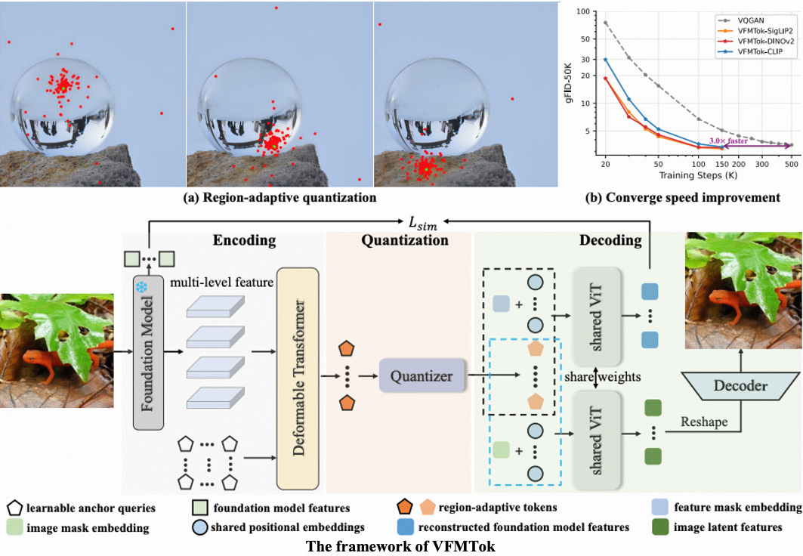

# Vision Foundation Models as Effective Visual Tokenizers for Autoregressive Generation <br><sub>Official PyTorch Implementation</sub>

[](https://arxiv.org/pdf/2507.08441)&nbsp;
[](https://huggingface.co/yexiguafu/VFMTok)&nbsp;


<p align="center">

<p>

This is a PyTorch/GPU implementation of the paper **Vision Foundation Models as Effective Visual Tokenizers for Autoregressive Generation**, which directly utilizes **the features from the frozen pre-trained vision foundation model (VFM) to reconstruct the original image**. To achieve this, VFMTok innovatively designed two key components: (1) a **region-adaptive quantization** framework that reduces redundancy in the pre-trained features on regular 2D grids, and (2) a semantic reconstruction objective that aligns the tokenizer’s outputs with the foundation model’s representations to preserve semantic fidelity. Once the trained VFMTok is integrated into the autoregressive (AR) generative models, it achieves notable results on the class-to-image generation task, while accelerating convergence by a factor of three. Besides, it also enables high-fidelity class-conditional synthesis **without the requirement of a CFG** (classifier-free guidance).

This repo contains:

* 🪐 A simple PyTorch implementation of VFMTok and various AR generative models.
* ⚡️ Pre-trained tokenizer: VFMTok and AR generative models trained on ImageNet.
* 🛸 Training and evaluation scripts for tokenizer and generative models, which were also provided in [here](./scripts).
* 🎉 Hugging Face for easy access to pre-trained models.


## Release

- [2024/07/11] 🔥 **VFMTok** has been released. Checkout the [paper](https://arxiv.org/pdf/2507.08441) for details.🔥
- [2025/09/18] 🔥 **VFMTok has been accepted by NeurIPS 2025!** 🔥
- [2025/10/11] 🔥 [Image tokenizers](https://huggingface.co/yexiguafu/VFMTok/tree/main/DINOv2/tokenizer) and [AR models](https://huggingface.co/yexiguafu/VFMTok/tree/main/DINOv2) for class-conditional image generation are released. 🔥
- [2025/10/11] 🔥 All codes of VFMTok have been released. 🔥

## Contents
- [Install](#install)
- [Model Zoo](#model-zoo)
- [Performance](#performance)
- [Train](#train)
- [Evaluation](#evaluation)

## Install

If you are not using Linux, do *NOT* proceed.

1. Clone this repository and navigate to Hita folder
```bash
git clone https://github.com/CVMI-Lab/VFMTok.git
cd Hita
```

2. Install Package
```Shell
conda create -n vfmtok python=3.10 -y
conda activate vfmtok
pip install --upgrade pip  # enable PEP 660 support
pip install -e .
```

3. Install additional packages for training cases as required.
```
pip install -e ".[train]"
pip install flash-attn --no-build-isolation
```
4. Install deformable attention module
```
vfmtok/modules/ops
bash make.sh
```
## Model Zoom

In this repo, we release:
* One image tokenizers: VFMTok(DINOv2).
* Class-conditional autoregressive generative models ranging from 100M to 3B parameters.

### 1. VQ-VAE models
In this repo, we release one image tokenizers: VFMTok(DINOv2). It directly utilizes the features from the frozen pre-trained VFM -- DINOv2, to reconstruct the image. To achieve this, VFMTok innovatively designed two key components: (1) a region-adaptive quantization framework that reduces redundancy in the pre-trained features on regular 2D grids, and (2) a semantic reconstruction objective that aligns the tokenizer’s outputs with the foundation model’s representations to preserve semantic fidelity. VFMTok exhibits better image reconstruction and semantic fidelity compared to the others.

Method | tokens | rFID (256x256) | rIS (256x256)    | weight
---    | :---:  |:---:|:---:   | :---: 
VFMTok |  256   | 0.98 | 215.4   | [hita-vanilla.pt](https://huggingface.co/yexiguafu/VFMTok/blob/main/DINOv2/tokenizer/vfmtok-tokenizer.pt)

### 2. AR generation models with classifier-free guidance.
Once the trained VFMTok(DINOv2) is integrated into autoregressive (AR) generative models, it ahieves notable image generation performance.

Method   | params | epochs | FID | sFID |  IS  | Pre. | Rec. | weight 
---      | :---:  | :---:  | :---:| :---: |:---: | :---:|:---:|  |:---:|
VFMTok-B  | 111M   |  300   | 3.43 | 5.88 | 252.2 | 0.85 | 0.53 | [VFMTok-B-300e.pt](https://huggingface.co/yexiguafu/VFMTok/blob/main/DINOv2/GPT-B/GPT-B-300e.pt)
VFMTok-L  | 343M   |  300   | 2.76 | 5.69 | 276.1 | 0.84 | 0.57 | [VFMTok-L-300e.pt](https://huggingface.co/yexiguafu/VFMTok/blob/main/DINOv2/GPT-L/GPT-L-300e.pt)
VFMTok-XL | 775M   |  200   | 2.38 | 5.54 | 277.2 | 0.83 | 0.60 | [VFMTok-XL-200e.pt](https://huggingface.co/yexiguafu/VFMTok/blob/main/DINOv2/GPT-XL/GPT-XL-200e.pt)
VFMTok-XXL| 1.4B   |  200   | 2.28 | 5.49 | 274.3 | 0.83 | 0.60 | [VFMTok-XXL-200e.pt](https://huggingface.co/yexiguafu/VFMTok/blob/main/DINOv2/GPT-XXL/GPT-XXL-200e.pt)
VFMTok-2B | 2.0B   |  200   | 2.27 | 5.56 | 283.6 | 0.82 | 0.61 | [VFMTok-2B-200e.pt](https://huggingface.co/yexiguafu/VFMTok/blob/main/DINOv2/GPT-2B/GPT-2B-200e.pt)
VFMTok-3B | 3.1B   |  200   | 2.07 | 6.23 | 280.4 | 0.82 | 0.61 | [VFMTok-3B-200e.pt](https://huggingface.co/yexiguafu/VFMTok/blob/main/DINOv2/GPT-3B/GPT-3B-200e.pt)

### 3. AR generation with CFG-free guidance
The trained VFMTok(DINOv2), when integrated into the AR generation models, can also achieve impressive image generation quality without CFG-guidance (CFG-free guidance).

Method   | params | epochs | FID | sFID |  IS  | Pre. | Rec. | weight 
---      | :---:  | :---:  | :---:| :---: |:---: | :---:|:---:|  |:---:|
VFMTok-B  | 111M   |  300   | 3.09 | 5.67 | 173.6 | 0.80 | 0.58 | [VFMTok-B-300e.pt](https://huggingface.co/yexiguafu/VFMTok/blob/main/DINOv2/GPT-B/GPT-B-300e.pt)
VFMTok-L  | 343M   |  300   | 2.15 | 5.44 | 230.1 | 0.82 | 0.60 | [VFMTok-L-300e.pt](https://huggingface.co/yexiguafu/VFMTok/blob/main/DINOv2/GPT-L/GPT-L-300e.pt)
VFMTok-XL | 775M   |  200   | 2.06 | 5.59 | 257.2 | 0.82 | 0.61 | [VFMTok-XL-200e.pt](https://huggingface.co/yexiguafu/VFMTok/blob/main/DINOv2/GPT-XL/GPT-XL-200e.pt)
VFMTok-XXL| 1.4B   |  200   | 2.09 | 5.48 | 259.3 | 0.82 | 0.61 | [VFMTok-XXL-200e.pt](https://huggingface.co/yexiguafu/VFMTok/blob/main/DINOv2/GPT-XXL/GPT-XXL-200e.pt)
VFMTok-2B | 2.0B   |  200   | 2.20 | 5.54 | 279.7 | 0.82 | 0.61 | [VFMTok-2B-200e.pt](https://huggingface.co/yexiguafu/VFMTok/blob/main/DINOv2/GPT-2B/GPT-2B-200e.pt)
VFMTok-3B | 3.1B   |  200   | 2.04 | 5.43 | 267.8 | 0.82 | 0.61 | [VFMTok-3B-200e.pt](https://huggingface.co/yexiguafu/VFMTok/blob/main/DINOv2/GPT-3B/GPT-3B-200e.pt)

## Training

### 1. Preparation

1. Download the [DINOv2-L](https://dl.fbaipublicfiles.com/dinov2/dinov2_vitl14/dinov2_vitl14_reg4_pretrain.pth) pre-trained foundation model from the official [model zoo](https://github.com/facebookresearch/dinov2).
2. Create symbolic links that point from the locations of the pretrained DINOv2-L model and the ImageNet training dataset folders to this directory.
3. Create dataset script for your own dataset. Here, we provide a template for training tokenizers and AR generative models using the ImageNet dataset in [LMDB](https://www.symas.com/mdb) format.

```bash
ln -s DINOv2-L_folder init_models
ln -s ImageNetFolder imagenet
```

### 2.VFMTok Training

1. Training VFMTok(DINOv2) tokenizer (see ```scripts/tokenizer/train_tok.sh```):

```bash
export NODE_COUNT=1
export NODE_RANK=0
export PROC_PER_NODE=8
scripts/autoregressive/torchrun.sh vq_train.py  --image-size 336 --results-dir output --mixed-precision bf16 --codebook-slots-embed-dim 12    \
    --data-path imagenet/lmdb/train_lmdb --global-batch-size 16 --num-workers 4 --ckpt-every 5000 --epochs 50 \
    --transformer-config configs/vit_transformer.yaml --log-every 1 --lr 1e-4 --ema --z-channels 512
```

### 3. AR generative model training

1. Training AR generative models (see ```scripts/autoregressive/run_train.sh```)

```bash
model_type='GPT-L' # 'GPT-B' 'GPT-XL' 'GPT-XXL' 'GPT-2B'
scripts/autoregressive/torchrun.sh train_c2i.py --gpt-type c2i --image-size 336 --gpt-model ${model_type} --downsample-size 16 --num-workers 4   \
    --anno-file imagenet/lmdb/train_lmdb --global-batch-size 512 --ckpt-every 10000 --ema --log-every 1 --results-dir output \
    --vq-model VQ-16 --vq-ckpt tokenizer/vfmtok-tokenizer.pt --latent-size 16 --mixed-precision bf16 --epochs 300
```

2. Resume from an AR generative checkpoint
```bash
model_type='GPT-L'
scripts/autoregressive/torchrun.sh train_c2i.py --gpt-type c2i --image-size 336 --gpt-model ${model_type} --downsample-size 16 --num-workers 4   \
    --anno-file imagenet/lmdb/train_lmdb --global-batch-size 512 --ckpt-every 10000 --ema --log-every 1 --results-dir output \
    --vq-model VQ-16 --vq-ckpt tokenizer/vfmtok-tokenizer.pt --latent-size 16 --mixed-precision bf16 --epochs 300 \
    --gpt-ckpt output/vanilla/${model_type}/${model_type}-{ckpt_name}.pt
```

### 4. Evaluation (ImageNet 256x256)

1. Evaluated a pretrained tokenizer (see ```scripts/tokenizer/run_tok.sh```):

```bash
scripts/autoregressive/torchrun.sh vqgan_test.py --vq-model VQ-16 --image-size 336 --output_dir recons --batch-size $1   \
        --z-channels 512 --vq-ckpt tokenizer/vfmtok-tokenizer.pt --codebook-slots-embed-dim 12
```

2. Evaluate a pretrained AR generative model (see ```scripts/autoregressive/run_test.sh```)

```bash
model_type='GPT-L' # 'GPT-B' 'GPT-XL' 'GPT-XXL' 'GPT-2B'
scripts/autoregressive/torchrun.sh test_net.py --vq-ckpt tokenizer/vfmtok-tokenizer.pt            \
    --gpt-ckpt snapshot/model_dump/${model_type}-$1.pt --compile --gpt-model ${model_type} --image-size 336 \
    --sample-dir samples --image-size-eval 256 --cfg-scale $2 --precision bf16 --per-proc-batch-size $3   \
    --codebook-slots-embed-dim 12 --latent-size 16
```
## Citation

If you find VFMTok useful for your research and applications, please kindly cite using this BibTeX:
```
@article{zheng2025holistic,
  title={Holistic Tokenizer for Autoregressive Image Generation},
  author={Zheng, Anlin and Wang, Haochen and Zhao, Yucheng and Deng, Weipeng and Wang, Tiancai and Zhang, Xiangyu and Qi, Xiaojuan},
  journal={arXiv preprint arXiv:2507.02358},
  year={2025}
}
@article{zheng2025vision,
  title={Vision Foundation Models as Effective Visual Tokenizers for Autoregressive Image Generation},
  author={Zheng, Anlin and Wen, Xin and Zhang, Xuanyang and Ma, Chuofan and Wang, Tiancai and Yu, Gang and Zhang, Xiangyu and Qi, Xiaojuan},
  journal={arXiv preprint arXiv:2507.08441},
  year={2025}
}
```

## License
The majority of this project is licensed under Apacha 2.0 License. Portions of the project are available under separate license of referred projects, detailed in corresponding files.


## Acknowledgement

Our codebase builds upon several excellent open-source projects, including [LlamaGen](https://github.com/FoundationVision/LlamaGen), [Deformable DETR](https://github.com/fundamentalvision/Deformable-DETR), [Hita](https://github.com/CVMI-Lab/Hita) and [Paintmind](https://github.com/Qiyuan-Ge/PaintMind). We are grateful to the communities behind them.

## Contact
This codebase has been cleaned up but has not undergone extensive testing. If you encounter any issues or have questions, please open a GitHub issue. We appreciate your feedback!